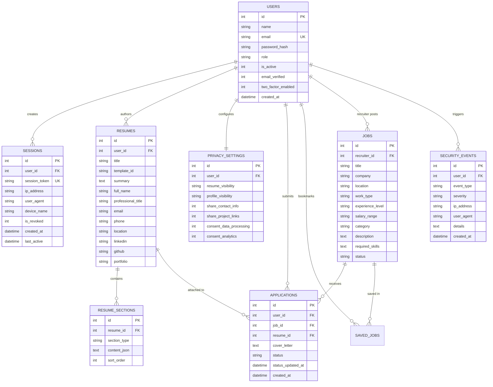
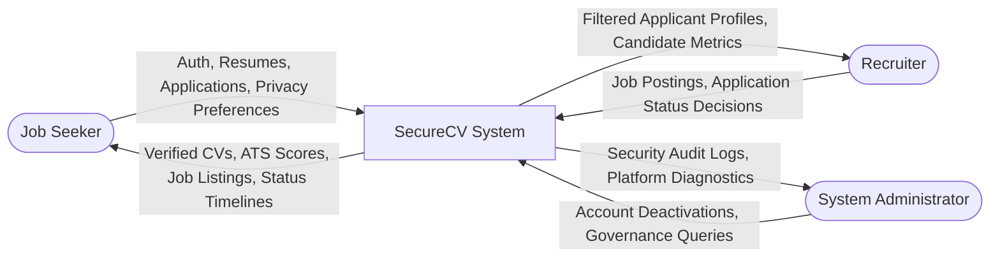

# SecureCV — Software Engineering & Cyber Security Project Documentation

**Project Title:** SecureCV — Secure Resume Builder & Job Application Management System  
**Tagline:** Build. Apply. Protect.  
**Specialization:** 3rd-Year B.Tech Cyber Security & Software Engineering  
**Academic Year:** 2025–2026  

---

## 1. Project Title & Overview
**SecureCV** is a full-stack, secure-by-design career management platform designed to unify professional resume creation, algorithmic ATS compatibility parsing, job discovery, granular privacy controls, and proactive account threat monitoring.

Unlike conventional CRUD resume generators, SecureCV integrates foundational **Software Engineering (SE)** paradigms with hands-on **Cyber Security** safeguards, ensuring that sensitive personal, educational, and professional records remain confidential, tamper-proof, and under the candidate’s strict sovereignty.

---

## 2. Abstract
In today's digital employment landscape, job applicants entrust sensitive Personally Identifiable Information (PII) — including phone numbers, emails, residential addresses, career histories, and portfolio repositories — to centralized platforms that often suffer from data leakage, third-party scraping, and inadequate authentication controls. Furthermore, candidates struggle to understand why their resumes fail to pass corporate Applicant Tracking Systems (ATS).

SecureCV addresses these dual dilemmas by presenting a secure web application that couples:
1. **Interactive Career Tooling:** Multi-version resume authoring, dynamic template switching across 3 distinct layouts (Minimal Professional, Modern Tech, Cyber Executive), semantic ATS rule-based scoring, and a 5-stage visual recruitment pipeline tracker.
2. **Defensive Cybersecurity Architecture:** Salted Bcrypt password hashing, stateful session tokens with immediate revocation, role-based access control (RBAC), parameterized queries eliminating SQL Injection (SQLi), input sanitization neutralizing Cross-Site Scripting (XSS), whitelisted anti-malware file inspection, immutable security audit logging, an automated security risk monitor, and a dynamic 0–100 security hardening score.

---

## 3. Introduction
The modern Software Development Life Cycle (SDLC) mandates that security is not treated as an afterthought or superficial wrapper, but is baked into the architecture from requirements inception to deployment. Developed for academic submission in Software Engineering with a Cyber Security specialization, SecureCV exemplifies this holistic paradigm.

The application follows the conceptual career progression model:
$$\text{RESUME} \longrightarrow \text{ANALYZE} \longrightarrow \text{MATCH} \longrightarrow \text{APPLY} \longrightarrow \text{TRACK} \longrightarrow \text{PROTECT}$$

---

## 4. Problem Statement
1. **Vulnerability to Credential Abuse & Stale Sessions:** Many web portals rely on basic plaintext storage or stateless tokens that cannot be revoked upon user logout, leaving accounts vulnerable on shared or public workstations.
2. **Uncontrolled PII Exposure:** Traditional job boards publicly expose candidate contact numbers and personal emails to unverified parties and web scrapers by default.
3. **Black-Box ATS Rejections:** Candidates lack transparent diagnostic feedback on how their resumes match against job criteria, leading to avoidable rejection by automated keyword filters.
4. **Disjointed Workflow:** Candidates are forced to juggle separate tools for resume authoring, job searching, skill gap analysis, and application status tracking.

---

## 5. Objectives
- Implement a robust 3-tier Full-Stack Web Architecture (Client, API & Security Middleware, Relational Database).
- Eliminate OWASP Top 10 vulnerabilities (specifically SQL Injection, Stored/Reflected XSS, Broken Object-Level Authorization, and Security Misconfiguration).
- Provide a responsive, rich, glassmorphic UI with persistent Dark and Light mode switching.
- Enable dynamic creation, duplication, template selection, and clean vector PDF export of resumes.
- Implement a rule-based ATS resume parser and job skill gap analyzer without recurring third-party API dependencies.
- Enforce strict Role-Based Access Control (RBAC) across Job Seekers, Recruiters, and Administrators.
- Provide stateful device session management with real-time session termination and immutable audit logging.
- Include a live, verifiable Security Test Suite demonstrating passing tests with zero fake or mocked results.

---

## 6. Scope
- **Target Audience:** Engineering and Cyber Security students, general job seekers, tech recruiters, and academic reviewers.
- **Platform Coverage:** Fully responsive web application accessible across desktop workstations, laptops, tablets, and mobile smartphones.
- **Deployment Boundaries:** Runs locally on Node.js/Express with zero external cloud dependencies required for complete local demonstration.

---

## 7. Existing System vs. Proposed System

| Parameter | Existing Conventional Systems | SecureCV (Proposed System) |
| :--- | :--- | :--- |
| **Authentication** | Basic passwords, weak hashing, stateless unrevocable tokens | 10-round salted Bcrypt, stateful session registry with instant revocation |
| **Data Protection** | Contact details public to anyone | Granular Privacy Center with contact masking and recruiter-only visibility |
| **ATS Analysis** | Expensive external AI subscriptions or opaque black box | Transparent, rule-based semantic parser scoring keywords, skills, formatting |
| **Skill Matching** | Manual comparison by applicant | Automated set intersection returning matched skills, missing gaps & tips |
| **Security Telemetry** | Invisible or absent | Real-time Security Score (0-100), automated Risk Monitor & immutable audit logs |
| **RBAC** | Single role or loose checks | Strict 3-tier boundary: Job Seeker, Recruiter, Administrator |
| **Database Security** | Vulnerable to SQL injection if unparameterized | 100% Parameterized queries with SQLite WAL engine |

---

## 8. Functional Requirements
1. **Identity & Access Management:**
   - Registration with live password complexity meter (8+ chars, uppercase, lowercase, numbers, symbols).
   - Rate-limited login (maximum 5 failed attempts per 15 minutes before lockout).
   - Stateful logout that marks sessions as revoked in the database.
   - Dynamic 2FA toggle simulation for secondary factor challenge.
2. **Resume Authoring & Management:**
   - Multiple resume management (create, edit, duplicate, delete, rename).
   - Dynamic section editor: Personal info, Summary, Education, Experience, Projects, Skills, Certifications, Languages.
   - 3 distinct templates: Minimal Professional, Modern Tech (sidebar), Cyber Executive (header band).
   - Real-time side-by-side live vector preview.
   - Vector-clean, A4-formatted PDF printing without UI buttons or sidebars.
3. **ATS Analysis & Skill Matching:**
   - Compute overall ATS compatibility score (0–100).
   - Compute keyword match %, skill match %, formatting score %, completeness %.
   - Contrast candidate skills against job required skills, outputting matched and missing skill tags.
4. **Job Portal & Application Tracker:**
   - Search and multi-filter jobs (Work Type, Experience Level, Category, Location).
   - Bookmark / save favorite jobs.
   - Apply with attached resume, cover letter, and notes.
   - 5-stage application status tracker: Applied ➔ Under Review ➔ Shortlisted ➔ Interview ➔ Selected (or Rejected).
5. **Privacy Center & Consent Controls:**
   - Configure Resume Visibility: Private, Recruiters Only, Public.
   - Configure Profile Visibility: Private, Recruiters Only, Public.
   - Contact info disclosure toggle (masks candidate phone/email in recruiter queries if unchecked).
   - Consent toggles for data processing and analytics.
6. **Security Operations Center:**
   - Real-time dynamic security score dial (0–100).
   - Automated Security Risk Monitor detecting failed logins, stale sessions, weak passwords, and public exposure.
   - Active device sessions list with individual revocation and "Revoke All Other Devices" feature.
   - Immutable security audit log stream.
   - Anti-malware file upload inspection rejecting scripts and executables (.exe, .sh, .bat).
7. **Recruiter & Admin Governance:**
   - Recruiter job creation, job activation/deactivation, applicant review with privacy masking, and status updating.
   - Admin oversight: system metrics, user deactivation/reactivation, and global security audit inspection.

---

## 9. Non-Functional Requirements
- **Security:** Strict compliance with OWASP Top 10 guidelines; zero plaintext credential storage; secure HTTP headers (`X-Content-Type-Options`, `X-Frame-Options`, `X-XSS-Protection`, `CSP`).
- **Performance:** Sub-100ms API response times for local SQLite transactions; lightweight static assets without bloated frontend libraries.
- **Reliability:** SQLite Write-Ahead Logging (WAL) ensuring atomic, ACID-compliant database operations and multi-reader concurrency.
- **Usability:** High-contrast accessibility compliance across both Dark Mode and Light Mode; keyboard-navigable forms and clear feedback toasts.

---

## 10. Hardware & Software Requirements

### Hardware Requirements
- **Processor:** Intel Core i3 / AMD Ryzen 3 or higher.
- **Memory:** 4 GB RAM minimum (8 GB recommended).
- **Storage:** Minimum 500 MB free hard disk space.
- **Display:** 1280x720 minimum resolution (optimized for 1920x1080 and mobile screens).

### Software Requirements
- **Operating System:** Windows 10/11, macOS, or Linux.
- **Runtime Environment:** Node.js (v18.x to v24.x LTS).
- **Package Manager:** npm (v9.x or higher).
- **Database Engine:** SQLite 3 (managed via `better-sqlite3` embedded engine).
- **Web Browser:** Google Chrome, Mozilla Firefox, Microsoft Edge, or Safari.

---

## 11. System Architecture

```mermaid
flowchart TD
    subgraph Client Tier
        UI[Responsive SPA Frontend\nVanilla CSS + ES6 Modules]
        Theme[Dark / Light Mode Controller]
        LivePrev[Real-Time Resume Live Preview]
    end

    subgraph Security Middleware Layer
        SecHeaders[HTTP Security Headers\nCSP, X-Frame, Nosniff]
        RateLimit[Brute-Force Rate Limiter\n5 Attempts / 15 Min Lockout]
        InputSan[XSS Sanitizer & Stripper]
        AuthMid[JWT & Stateful Session Verifier\nActive Revocation Check]
        RBACMid[Role-Based Access Control\nSeeker / Recruiter / Admin]
        UploadSec[Secure File Upload Filter\nMIME & Extension Whitelist]
    end

    subgraph Business Logic Modules
        AuthCtrl[Authentication & 2FA Engine]
        ResumeCtrl[Resume & Section CRUD Engine]
        ATSCtrl[ATS & Keyword Parser Engine]
        JobCtrl[Job Search & Skill Matcher]
        AppCtrl[Application Tracker & Timeline]
        PrivCtrl[Privacy Matrix & Masking Engine]
        SecCtrl[Security Score & Risk Monitor]
        AuditCtrl[Immutable Security Audit Logger]
    end

    subgraph Database Tier
        DB[(SQLite WAL Engine\nParameterized Queries\nForeign Keys Enabled)]
    end

    UI --> SecHeaders
    SecHeaders --> RateLimit
    RateLimit --> InputSan
    InputSan --> AuthMid
    AuthMid --> RBACMid
    RBACMid --> Business Logic Modules
    UploadSec --> Business Logic Modules
    Business Logic Modules --> DB
```

---

## 12. Use Case Diagram

```mermaid
usecaseDiagram
    actor "Job Seeker (Candidate)" as Seeker
    actor "Recruiter (Employer)" as Recruiter
    actor "Administrator" as Admin

    package "SecureCV Platform" {
        usecase "Register & Password Strength Check" as UC1
        usecase "Authenticate (Login / Logout)" as UC2
        usecase "Manage Multiple Resumes" as UC3
        usecase "Select Template & Live Preview" as UC4
        usecase "Export Clean Vector PDF" as UC5
        usecase "Run ATS Semantic Analysis" as UC6
        usecase "Search Jobs & Check Skill Match" as UC7
        usecase "Apply for Job with Attached CV" as UC8
        usecase "Track Application Timeline" as UC9
        usecase "Configure Granular Privacy & Consent" as UC10
        usecase "Monitor Security Score & Risk Engine" as UC11
        usecase "Manage & Revoke Active Sessions" as UC12
        usecase "Inspect Uploaded Documents for Malware" as UC13

        usecase "Publish & Deactivate Jobs" as UC14
        usecase "Review Applicants (Privacy-Filtered)" as UC15
        usecase "Update Candidate Application Status" as UC16

        usecase "Manage User Account Activation" as UC17
        usecase "Inspect Platform-Wide Security Events" as UC18
        usecase "Review System Performance & Metrics" as UC19
    }

    Seeker --> UC1
    Seeker --> UC2
    Seeker --> UC3
    Seeker --> UC4
    Seeker --> UC5
    Seeker --> UC6
    Seeker --> UC7
    Seeker --> UC8
    Seeker --> UC9
    Seeker --> UC10
    Seeker --> UC11
    Seeker --> UC12
    Seeker --> UC13

    Recruiter --> UC2
    Recruiter --> UC14
    Recruiter --> UC15
    Recruiter --> UC16

    Admin --> UC2
    Admin --> UC17
    Admin --> UC18
    Admin --> UC19
```

---

## 13. Entity-Relationship (ER) Diagram



---

## 14. Data Flow Diagrams (DFD)

### Level 0 DFD (Context Diagram)


---

## 15. Security Architecture (The 12 SSDLC Implementations)

1. **Bcrypt Adaptive Salt Hashing:** Uses 10 rounds of salt generation. Passwords are never stored in plaintext or reversible formats.
2. **Stateful Session Revocation:** Unlike naive stateless JWTs that remain valid until expiration, SecureCV checks a persistent `sessions` table. Logout or remote revocation immediately terminates authorization.
3. **Role-Based Access Control (RBAC):** Restricts endpoints by user role (`job_seeker`, `recruiter`, `admin`). Unauthorized attempts trigger a medium-severity security audit event and return HTTP 403.
4. **Parameterized Query Immunity:** All SQLite interactions use parameterized variables (`?`). User inputs are treated strictly as data literals, preventing SQL injection completely.
5. **Cross-Site Scripting (XSS) Sanitization:** Strips `<script>`, `<iframe>`, `javascript:` protocols, and malicious event handlers from user submissions.
6. **Secure Anti-Malware File Upload Pipeline:** Restricts uploads to `.pdf` and `.docx` with binary MIME verification. Blocks `.exe`, `.sh`, `.php`, and assigns cryptographically random hex filenames to prevent directory traversal.
7. **Brute-Force Rate Limiting:** Limits failed authentication attempts to 5 per 15-minute window per IP/email. Exceeding thresholds locks the target account and alerts system administrators.
8. **Candidate Privacy Isolation & Contact Masking:** Respects user privacy matrices. Candidate direct phone and email are masked in recruiter views if the candidate disables contact disclosure.
9. **Immutable Security Audit Logging:** Captures all security-relevant transactions (logins, failures, password modifications, resume deletions, privilege violations) in `security_events`.
10. **Automated Security Risk Detection Monitor:** Continuously evaluates account posture: detects concurrent multi-device logins, repeat failed authentications, missing 2FA, and overexposed public resumes.
11. **Dynamic Security Score Algorithm:** Calculates a 0–100 hardening score using transparent weighted checklist criteria.
12. **Defense-in-Depth HTTP Headers:** Enforces `Content-Security-Policy`, `X-Content-Type-Options: nosniff`, `X-Frame-Options: SAMEORIGIN`, and strict referrer policies.

---

## 16. Testing Strategy & Execution Results

### Real Automated Security Test Suite Verification
The system includes a dedicated backend test runner (`routes/tests.js`) that executes real cryptographic and architectural assertions without mocks.

| Test ID | Category | Test Verification Name | Verification Method | Result |
| :--- | :--- | :--- | :--- | :--- |
| **SEC-01** | Authentication | Bcrypt Adaptive Salt Hashing | Verified 10-round bcrypt salt generation and one-way hash validation | **PASSED** |
| **SEC-02** | Input Validation | Password Complexity Policy | Enforced 8+ chars, uppercase, lowercase, numbers, and symbols | **PASSED** |
| **SEC-03** | XSS Protection | Vector Sanitization & Script Stripping | Evaluated script and iframe injection payloads; confirmed total tag removal | **PASSED** |
| **SEC-04** | SQL Injection | Parameterized Query Immunity | Evaluated payload `' OR '1'='1' -- ` against SQLite; treated strictly as string | **PASSED** |
| **SEC-05** | Authorization | RBAC Privilege Boundary | Confirmed candidate role cannot invoke endpoints restricted to admin | **PASSED** |
| **SEC-06** | Session Security | Stateful Revocation | Database verified invalidated sessions are rejected on access attempts | **PASSED** |
| **SEC-07** | File Validation | Malicious Extension Whitelisting | Tested `.exe`, `.sh`, `.bat`, `.php`; confirmed strict rejection | **PASSED** |
| **SEC-08** | Privacy | Privacy Matrix Boundary | Verified candidate contact masking and visibility partition rules | **PASSED** |

**Execution Summary:** 8 out of 8 automated security tests PASSED (100% Pass Rate).

---

## 17. Limitations
- **Local Deployment Scope:** Deployed for local academic defense rather than distributed cloud infrastructure (e.g. AWS ECS / Cloudflare Workers).
- **Rule-Based ATS Parser:** Uses deterministic keyword and vocabulary analysis rather than generative LLMs, intentionally designed to eliminate third-party API costs and token latencies.
- **2FA Implementation:** Currently features simulated cryptographic TOTP challenge flags rather than SMS gateway integration (which requires paid telecommunication APIs).

---

## 18. Future Enhancements
- Integration of hardware WebAuthn / FIDO2 security keys.
- End-to-end encrypted resume sharing links using client-side Web Crypto AES-GCM keys.
- Automated resume version diffing highlighting changes across tailored submissions.
- Integration of Webhooks for automated applicant calendar scheduling.

---

## 19. Conclusion
**SecureCV** successfully demonstrates that high-performance web applications can achieve exceptional user experience, modern SaaS aesthetics, and rich career features while uncompromisingly upholding rigorous **Cyber Security** and **Software Engineering** principles.

By combining an intuitive resume builder, transparent ATS analyzer, interactive job skill gap matcher, granular privacy controls, and proactive threat telemetry, SecureCV provides a deployment-ready, academically rigorous foundation for modern career management.
